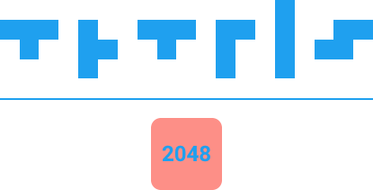

## Tetris 2048 — Python Game

Tetris 2048 is a hybrid puzzle game that combines the falling-block mechanics of Tetris with the tile-merging rules of 2048.
This project is built in Python and uses a custom graphics library (stddraw, color, picture) to render the game interface.

## 🎮 Game Overview

In Tetris 2048, each falling block is a tetromino made of numbered tiles (2, 4, 8, …).
When two tiles of the same value touch, they merge into a new tile with double the value — following the classic 2048 rules.

The goal:

* Merge tiles to reach higher values

* Prevent the grid from filling up

* Achieve the highest score possible

📁 Project Structure
```text
Tetris_2048_Base_Code/
│
├── Tetris_2048.py          # Main entry point of the game
├── game_grid.py            # Manages grid logic and tile merging
├── tetromino.py            # Tetromino shapes and movement
├── tile.py                 # Tile class (value, merge logic, drawing)
├── point.py                # Utility class for coordinates
│
├── lib/                    # Graphics library
│   ├── stddraw.py
│   ├── picture.py
│   └── color.py
│
├── images/
│   └── menu_image.png      # Startup/menu screen image
│
└── sounds/
    └── Tetris.mp3          # Background music
```
## 🛠 Requirements

* Python 3.10+ recommended

* No external dependencies — custom rendering library included in lib/

* Requires a system capable of opening GUI windows (for stddraw)

## ▶️ How to Run

1. Download or clone the repository.

2. Ensure the directory structure remains unchanged.

3. Run the main script:
```bash
python3 Tetris_2048.py
```

The game window will open automatically.

---

## ⌨️ Controls
```text
Key	Action
← / →	Move tetromino left/right
↓	Soft drop
↑	Rotate
Space	Hard drop
Esc	Quit
```
## 🧩 Features

✔️ Classic falling-block gameplay

✔️ Tile merging (2048 mechanics)

✔️ Grid-based collision management

✔️ Animated rendering through custom graphics library

✔️ Background music

✔️ Clean, modular Python codebase

## 📷 Menu Image



---

## 📌 Future Improvements

* Ghost piece preview

* Scoring system enhancements

* High score saving

* Improved UI and animations

* Additional sound effects

## 📄 License

MIT License © 2025 Kerem Ataç
